Picammory
=========

The Garden's Camera based on Raspberry Pi (with motion detection)

## Camera Body

The SecurityMan SM-3802 include an aluminum body with plenty of space inside.  
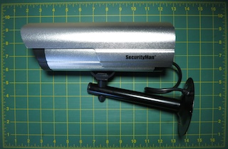

The presence of multiple grove provide a way to secure the internal circuit board.  
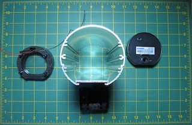

The only complain is about the arm, very difficult to have a precise horizontal rotation of the camera, very difficult to hold tight.

The Raspberry Pi and all component are placed on the Styrene Sheets, this way it is easy to insert and remove the Pi from the body. 0.08 thick styrene fit perfectly in the lower grove.  
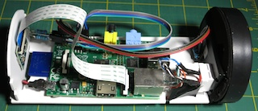  

## Power Supply & Network connector

The Raspberry Pi is powered throughout the ethernet cable. When an ethernet cable is used for 10 and 100Mb only 4 cable over the 8 available are used for data. The passive PoE Injector used the remaining 4 unused cables to provide the 12DC powers. In the camera, a DC converter is used to convert the 12V to the Raspberry friendly 5V.

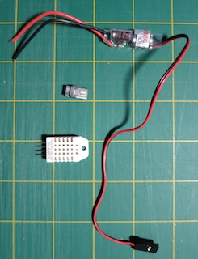

On the Raspberry board, I want to let the maximum of space next to the USB connector for future extention. All the network/power connector are push on one side of the board, within a very limited space.  

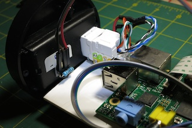

 A Keystone Jack is fixed on the board, the 4 data cable (green and orange) are connected to a Cat5e male crimp connector.   
The Cat5e male connector was cut in half to fit in the small available space .  
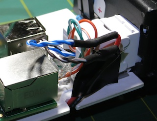

From the Keystone Jack, the 4 power cable (blue and brown) are connected to the input of the DC converter. The cable goes under the board where the UBEC DC converter is fixed   
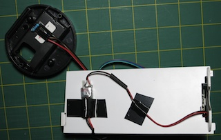
 
The 5V power cable is them connected to a micro USB connector with some Heat Shrink tubing around.
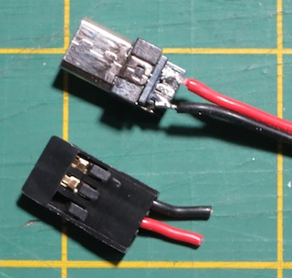
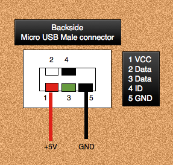
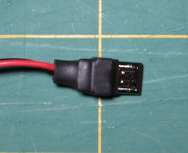

And finally the power cable is connected to the Raspberry Pi.   
The custom power cable permit the connection in the small space between the front face and the Raspberry Pi.  

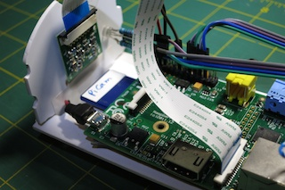

A square hole is perform in the back of the camera cover for the Keystone Jack.  

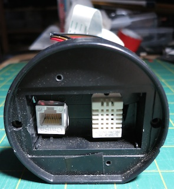

## Camera Sensor

A custom front plate is cut from the Styrene Sheets to maintain the sensor in place, and hide the Camera inside from curious ;-)   

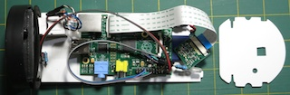
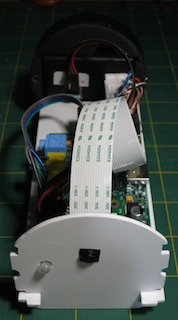

Note: In this configuration, the sensor is rotated by 180°.

## RGB LED

A GPIO pin is limited to 16mA, for a total for all pins to 50mA. The design is for 3mA per pin (17 pins * 3mA = 51mA).
We do not need the usual 20mA per LED, 6mA is probably enough for what is mainly a debug indicator.
From the measure of the forward voltage for each color, we get the value for each resistor

Color | FV | ohm
------|----|-----
Red   |1.7V|270
Green |2.4V|150
Blue  |2.5V|150

The position of the LED was selected to reduce the impact on the GPIO port and keep the cable on the same side of the board to not interfere with the camera sensor cable.

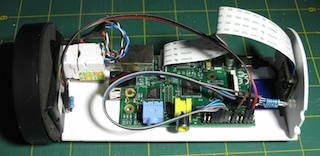

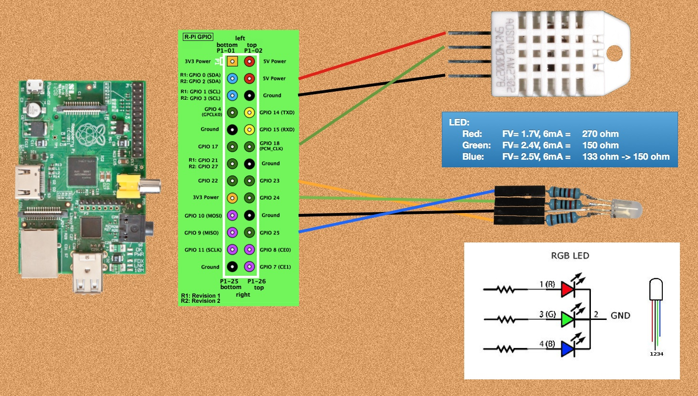

## Temperature And Humidity Sensor

TBD

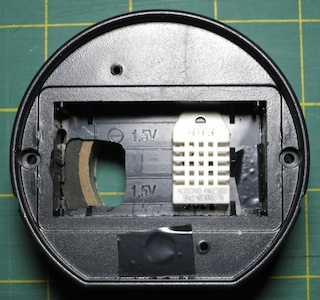
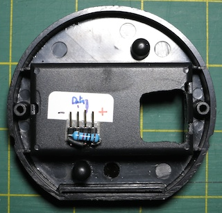

## Parts and Cost

Description | Reference | Price | Store
------------|-----------|------:|:-----:
CPU | Raspberry Pi Model B | $35.00 | [Newark](http://www.newark.com/raspberry-pi/raspbrry-modb-512m/model-b-assembled-board-only/dp/43W5302)
Sensor | Raspberry PI 5MP Camera Board Module | $25.00 | [Newark](http://www.newark.com/raspberry-pi/rpi-camera-board/unknown/dp/69W0689)
Camera Body | SecurityMan SM-3802 Dummy Outdoor/Indoor Camera | $16.61 | [Amazon](http://www.amazon.com/gp/product/B003AXEFMI)
Power Supply | DC 12V 2A | $13.00 |
SD Card | Transcend 16 GB | $12.76 |
Power part | Huacam HCP05 Passive PoE Injector/Splitter DC Connector | $6.89 | [Amazon](http://www.amazon.com/gp/product/B00DZLSRJC)
DC/DC Converter | UBEC Input: 5-23v Output:5V 3a | $4.76 | [Amazon](http://www.amazon.com/gp/product/B00DSKJGIQ)
Board | Styrene Sheets - White - 12x12 0.08 Thick ($10.99/10)| $1.10  | [Amazon](http://www.amazon.com/gp/product/B00ICMZ62A)
| Punch Down Keystone Jack Cat-5e RJ-45 ($5.19/5)| $1.04 | [Amazon](http://www.amazon.com/gp/product/B004P3EK2M)
Cable | 20cm Female to Female 2.54mm 0.1 Inch Jumper Cable Wires Connector ($3.99/5)| $0.80 | [Amazon](http://www.amazon.com/gp/product/B00D8WOWMY)
USB connector | Micro USB Type A Male 5 Pin Connectors Jack ($3.90/10)| $0.39 | [Amazon](http://www.amazon.com/gp/product/B00AQWUCAA)
|Cat6, Cat5e crimp connectors pack of 100 ($9.76/100)|$0.10|[Amazon](http://www.amazon.com/gp/product/B00BS92DCK)
| 3 Resistors: 270 ohm, 2x 150 ohm| $0.10 |
| Heat Shrink tubing | $0.10 |
| RGB Led ($2.67/50)| $0.05 | [Amazon](http://www.amazon.com/gp/product/B005VMDROS)
***Total*** | | ***$117*** |

For future use:

Description | Reference | Price | Store
------------|-----------|------:|:-----:
| DHT22 Digital Temperature And Humidity Sensor | $6.49 | [Amazon](http://www.amazon.com/gp/product/B00CDHH3WQ)

  
