Picammory
=========

The Garden's Camera based on Raspberry Pi (with motion detection)


# Introduction

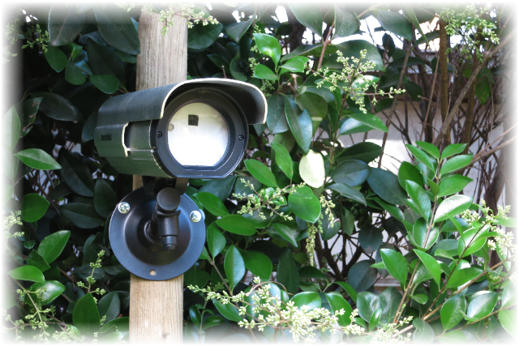
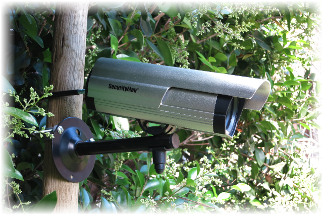

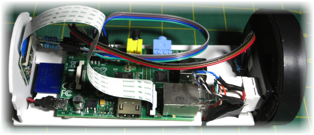

This project build a high definition camera from a dummy outdoor camera.  
The camera objective are to:

1. Take hourly full definition picture of the garden
2. Detect garden's intrusion from a noisy environment (tree, leaf, wind, sun, ...)
3. Record garden local temperature and humidity to feed the sprinkler controller (TBD)

Picammera includes the following item:

* Capture of one full size image every hour
* Python3 with C functions for fast image processing
	* Image capture: 100ms
	* Image processing: 26ms
* Advanced motion detection algorithms from 5 stages:
	1. Moving Average of previous image (with low memory usage)
	2. Difference between moving average and current image
	3. Moving Average Mask to automatically remove noisy pixel
	4. Surface detection to convert adjacent pixels to surface (with very efficient algorithm)
	5. Surface processing to detect motion
* Continus HD video recording in memory
* Save about 10s of video before the trigger event
* send mail upon motion detection
* upload movies on a FTP server
* automatically convert h264 movies to mp4
* Bonjour to advertise services
* ASP for easy file sharing with Mac
* WiringPi for GPIO access without root privilege
* Automatic start at boot, and restart after a crash (restartd)

===

# Hardware Build

An overview of the hardware, and electronic schematic, used to build the camera:

## Camera Body

The SecurityMan SM-3802 include an aluminum body with plenty of space inside.  
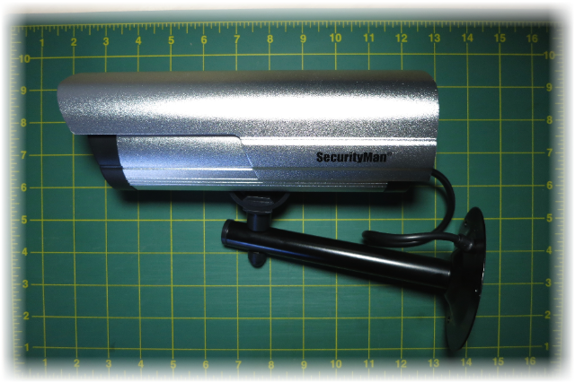

The presence of multiple grove provide a way to secure the internal circuit board.  
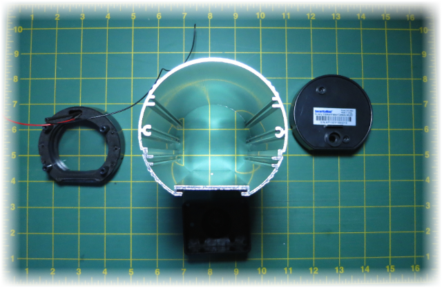

The only complain is about the arm, very difficult to have a precise horizontal rotation of the camera, very difficult to hold tight.

The Raspberry Pi and all component are placed on the Styrene Sheets, this way it is easy to insert and remove the Pi from the body. 0.08 thick styrene fit perfectly in the lower grove.  
  

## Power Supply & Network connector


The Raspberry Pi is powered throughout the ethernet cable. When an ethernet cable is used for 10 and 100Mb only 4 cable over the 8 available are used for data. The passive PoE Injector used the remaining 4 unused cables to provide the 12DC powers. In the camera, a DC converter is used to convert the 12V to the Raspberry friendly 5V.


On the Raspberry board, I want to let the maximum of space next to the USB connector for future extension. All the network/power connector are push on one side of the board, within a very limited space.  

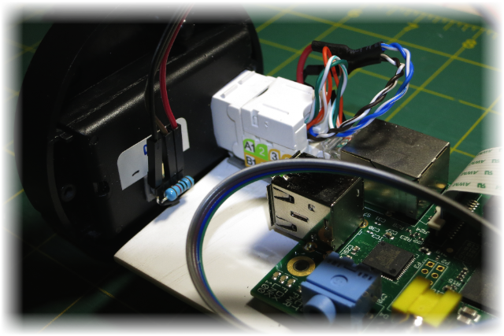

 A Keystone Jack is fixed on the board, the 4 data cable (green and orange) are connected to a Cat5e male crimp connector.   
The Cat5e male connector was cut in half to fit in the small available space .  
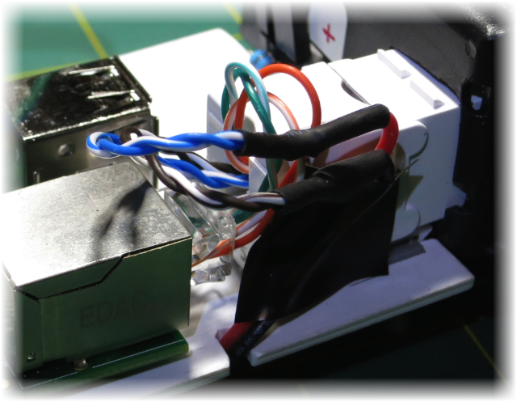

From the Keystone Jack, the 4 power cable (blue and brown) are connected to the input of the DC converter. The cable goes under the board where the UBEC DC converter is fixed   
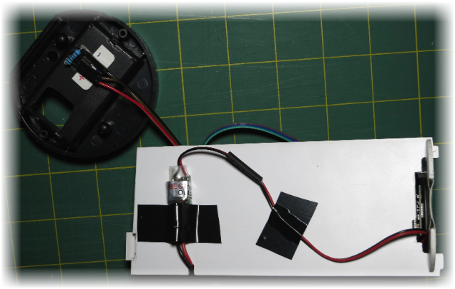
 
The 5V power cable is them connected to a micro USB connector with some Heat Shrink tubing around.
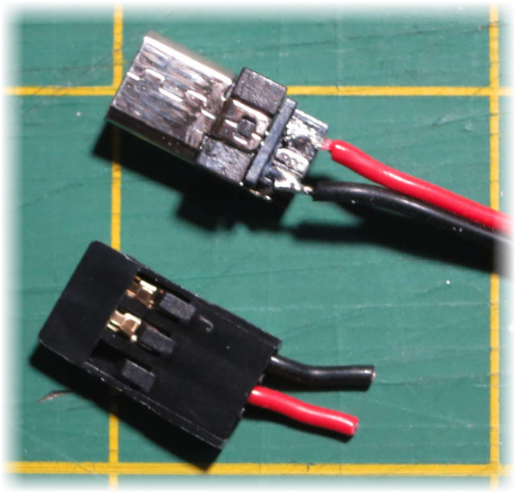

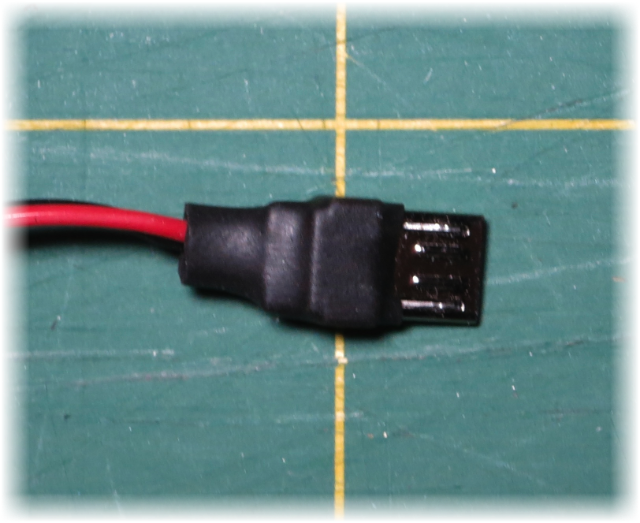

And finally the power cable is connected to the Raspberry Pi.   
The custom power cable permit the connection in the small space between the front face and the Raspberry Pi.  


A square hole is perform in the back of the camera cover for the Keystone Jack.  

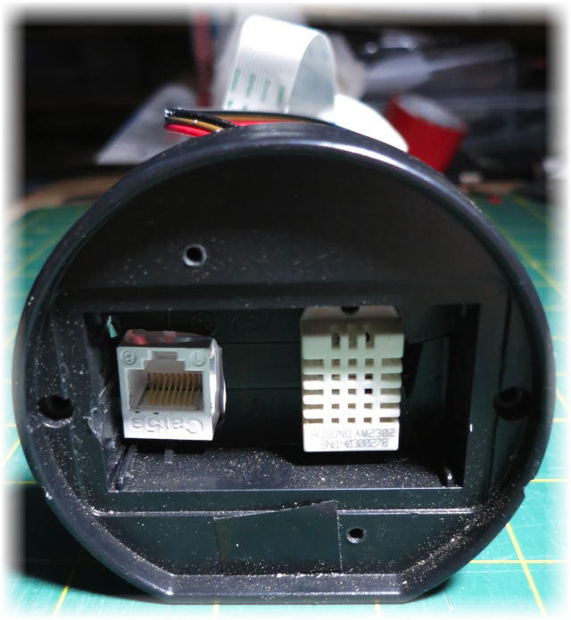

## Camera Sensor

A custom front plate is cut from the Styrene Sheets to maintain the sensor in place, and hide the Camera inside from curious ;-)   

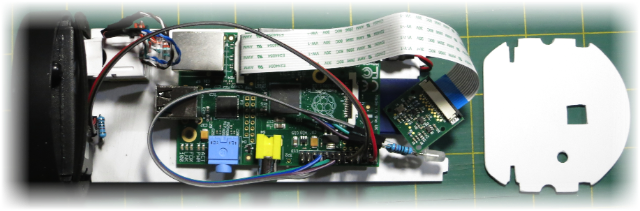
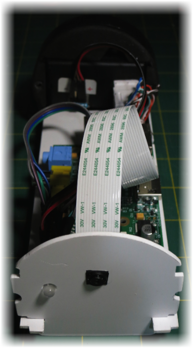

Note: In this configuration, the sensor is rotated by 180°.

## RGB LED

A GPIO pin is limited to 16mA, for a total for all pins to 50mA. The design is for 3mA per pin (17 pins * 3mA = 51mA).
We do not need the usual 20mA per LED, 6mA is probably enough for what is mainly a debug indicator.
From the measure of the forward voltage for each color, we get the value for each resistor

Color | FV | ohm
------|----|-----
Red   |1.7V|270
Green |2.4V|150
Blue  |2.5V|150

The position of the LED was selected to reduce the impact on the GPIO port and keep the cable on the same side of the board to not interfere with the camera sensor cable.

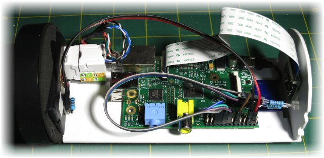


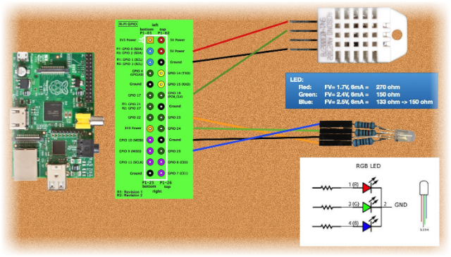

## Temperature And Humidity Sensor

TBD

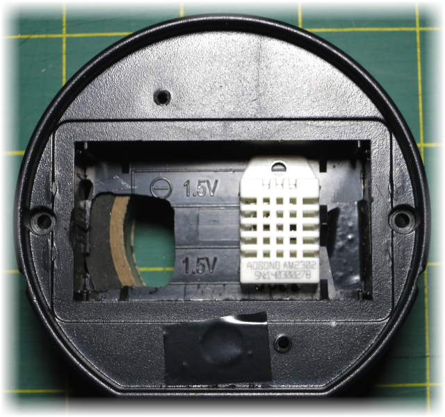
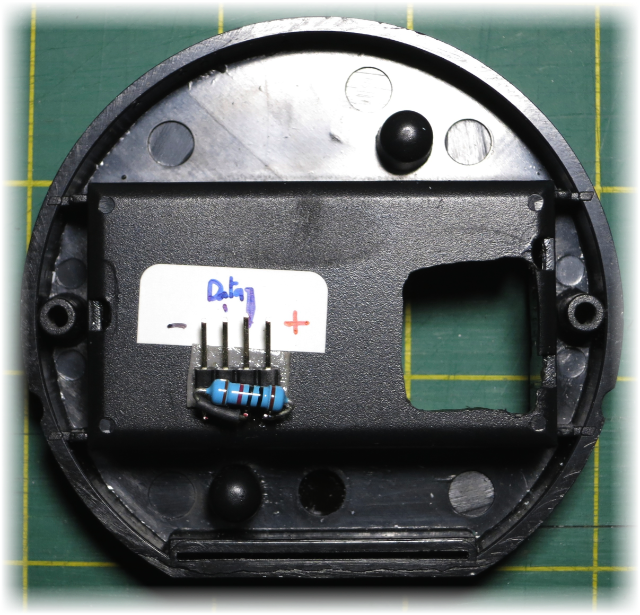


## Parts and Cost

Description | Reference | Price | Store
------------|-----------|------:|:-----:
CPU | Raspberry Pi Model B | $35.00 | [Newark](http://www.newark.com/raspberry-pi/raspbrry-modb-512m/model-b-assembled-board-only/dp/43W5302)
Sensor | Raspberry PI 5MP Camera Board Module | $25.00 | [Newark](http://www.newark.com/raspberry-pi/rpi-camera-board/unknown/dp/69W0689)
Camera Body | SecurityMan SM-3802 Dummy Outdoor/Indoor Camera | $16.61 | [Amazon](http://www.amazon.com/gp/product/B003AXEFMI)
Power Supply | DC 12V 2A | $13.00 |
SD Card | Transcend 16 GB | $12.76 |
Power part | Huacam HCP05 Passive PoE Injector/Splitter DC Connector | $6.89 | [Amazon](http://www.amazon.com/gp/product/B00DZLSRJC)
DC/DC Converter | UBEC Input: 5-23v Output:5V 3a | $4.76 | [Amazon](http://www.amazon.com/gp/product/B00DSKJGIQ)
Board | Styrene Sheets - White - 12x12 0.08 Thick ($10.99/10)| $1.10  | [Amazon](http://www.amazon.com/gp/product/B00ICMZ62A)
| Punch Down Keystone Jack Cat-5e RJ-45 ($5.19/5)| $1.04 | [Amazon](http://www.amazon.com/gp/product/B004P3EK2M)
Cable | 20cm Female to Female 2.54mm 0.1 Inch Jumper Cable Wires Connector ($3.99/5)| $0.80 | [Amazon](http://www.amazon.com/gp/product/B00D8WOWMY)
USB connector | Micro USB Type A Male 5 Pin Connectors Jack ($3.90/10)| $0.39 | [Amazon](http://www.amazon.com/gp/product/B00AQWUCAA)
|Cat6, Cat5e crimp connectors pack of 100 ($9.76/100)|$0.10|[Amazon](http://www.amazon.com/gp/product/B00BS92DCK)
| 3 Resistors: 270 ohm, 2x 150 ohm| $0.10 |
| Heat Shrink tubing | $0.10 |
| RGB Led ($2.67/50)| $0.05 | [Amazon](http://www.amazon.com/gp/product/B005VMDROS)
***Total*** | | ***$117*** |

For future use:

Description | Reference | Price | Store
------------|-----------|------:|:-----:
| DHT22 Digital Temperature And Humidity Sensor | $6.49 | [Amazon](http://www.amazon.com/gp/product/B00CDHH3WQ)


===


# Software Installation and Setup

A complete step by step installation:


## Setting Up the Raspberry Pi

Copying an image to the SD card in Mac OS X (mostly graphical interface)
http://elinux.org/RPi_Easy_SD_Card_Setup

Download the image from a mirror or torrent
http://www.raspberrypi.org/downloads
    
Raw Images Raspbian, Release Date	2014-01-07

Extract the image by double clicking on the download file

Connect the SD card reader with the SD card inside;

From the Apple () menu, choose About This Mac, then click on More info...; if you are using Mac OS X 10.8.x Mountain Lion then click on System report.

Click on USB (or Card Reader if using an in-built SD card reader) then search for your SD card in the upper right section of the window; click it, then search for BSD name in the lower right section: must be something like diskn where n is a number (for example, disk4). Note this number

Unmount the partition so that you will be allowed to overwrite the disk by opening Disk Utility and unmounting it (do not eject it, or you have to reconnect it). Note: On Mac OS X 10.8.x Mountain Lion, "Verify Disk" (before unmounting) will display the BSD name as "/dev/disk1s1" (or similar), allowing you to skip the previous two steps.

From the Terminal run:
``` bash
sudo dd if=path_of_your_image.img of=/dev/diskn bs=1m
```
Remember to replace n with the number that you noted before!

	<!> Warning: giving a wrong number for '/dev/diskn' can damage your computer,
		be extremely careful with 'dd' command.

Wait a LONG time!

Insert it in the Raspberry Pi, and have fun

## Raspbian Initial Settings

``` bash
$ ssh pi@<ip address>
  password: raspberry
$ sudo raspi-config
```
Modify the following item:

* 1 ***Expand Filesystem***

* 2 Change User Password

* 4 Internationalisation Options

	* I1 Change Locale
	    * Remove en_GB.UTF-8 UTF-8
	    * Add en_US.UTF-8 UTF-8
    
	    * Default: en_US.UTF-8
    
    * I2 Change Timezone
    
	    * US
	    * Pacific Ocean


* ***5 Enable Camera***

* Advanced Options

	* A2 Hostname

		* PiCammory
    
Note: only 1 and 5 are required.

Reboot to apply changes
        
``` bash
$ sudo shutdown -r now
```

Optionally, after rebooting, check the time and timezone

``` bash
$ date
```
        
## Update Raspbian

``` bash
$ sudo apt-get update
$ sudo apt-get upgrade
```

## Install Netatalk & Bonjour
Netatalk is a freely-available Open Source AFP fileserver.

``` bash
$ sudo apt-get install netatalk
```
Register ASP (File sharing with Mac)
``` bash
$ sudo nano /etc/avahi/services/afpd.service

<?xml version="1.0" standalone='no'?>
<!DOCTYPE service-group SYSTEM "avahi-service.dtd">
<service-group>
    <name replace-wildcards="yes">%h</name>
    <service>
        <type>_afpovertcp._tcp</type>
        <port>548</port>
    </service>
</service-group>
```
Register SSH (Remote Shell)
``` bash
$ sudo nano /etc/avahi/services/ssh.service

<?xml version="1.0" standalone='no'?>
<!DOCTYPE service-group SYSTEM "avahi-service.dtd">
<service-group>
    <name replace-wildcards="yes">%h</name>
    <service>
        <type>_ssh._tcp</type>
        <port>22</port>
    </service>
</service-group>

$ sudo /etc/init.d/avahi-daemon restart
```
Test of Bonjour: Browse for mDNS/DNS-SD services using the Avahi daemon
``` bash
$ sudo apt-get install avahi-utils

$ avahi-browse -a
```
Install library needed for Python
``` bash
$ sudo apt-get install libavahi-compat-libdnssd1
```

## Install Python3 Goodies

``` bash
$ sudo apt-get install python3-dev
$ sudo apt-get install python3-setuptools
$ sudo apt-get install python3-pip
```
## Install WiringPi
GPIO Interface library for the Raspberry Pi

``` bash
$ git clone git://git.drogon.net/wiringPi
$ cd wiringPi
$ ./build
$ gpio -v
$ gpio readall
```

Optional:

``` bash
$ /usr/local/bin/gpio export 5 out
$ /usr/local/bin/gpio export 23 out
$ /usr/local/bin/gpio export 24 out
$ /usr/local/bin/gpio export 25 out
$ ls -l /sys/devices/virtual/gpio
total 0
drwxrwx--- 3 root gpio 0 Apr 27 08:41 gpio18
drwxrwx--- 3 root gpio 0 Apr 27 08:41 gpio23
drwxrwx--- 3 root gpio 0 Apr 27 08:41 gpio24
drwxrwx--- 3 root gpio 0 Apr 27 08:41 gpio5
drwxrwx--- 3 root gpio 0 Dec 31  1969 gpiochip0
```

## Install WiringPi2-Python
Python-wrapped version of Gordon Henderson's WiringPi version 2.

``` bash
$ git clone https://github.com/Gadgetoid/WiringPi2-Python.git
$ cd WiringPi2-Python
$ sudo python3 setup.py install
```

## Install PiCamera

``` bash
$ sudo apt-get install python3-picamera
```


If you get an error during Picammory execution, like:

``` bash
    File "/usr/lib/python3/dist-packages/picamera/camera.py", line 1470, in _get_frame
    return self._encoders.values()[0].frame
TypeError: 'dict_values' object does not support indexing
```

you need to change the line 1470 in /usr/lib/python3/dist-packages/picamera/camera.py from
``` Python3
return self._encoders.values()[0].frame
```
to
``` Python3
return (self._encoders.values())[0].frame
```

this is fixed in development version but not yet released.

## Install Python3 PIL
Python Imaging Library

``` bash
$ sudo pip-3.2 install Pillow
```

## Install GPAC
Multimedia Framework for MPEG-4, VRML, X3D, SVG, LASeR ...
http://gpac.wp.mines-telecom.fr

``` bash
$ sudo apt-get install gpac
```

## Install Picammory


### Download Picammory sources

for the last released version:
``` bash
$ git clone https://github.com/pmermoz/picammory.git ~/
```

or, for the current development version:
``` bash
$ git clone https://github.com/pmermoz/picammory.git -b develop ~/
```

### Build the C source code
Note: This step is optional, Picammory will rebuild the C code at startup.
``` bash
$ cd ~/picammory; python3 setup.py build_ext --inplace; cd ..
```

### Create the log files folder

``` bash
$ sudo mkdir /var/log/picammory
$ sudo chown pi /var/log/picammory
```

### Edit the configuration file
``` bash
$ nano ~/picammory/picammory.ini
```

* **[camera]**
	* **name**
	
		Name for your camera, this name is used to prefix filenames generated by the camera.

* **[smtp]**


	Picammory send mail to inform of system status and detection events.
	* **username**
	
		User name for your email account
	* **password**
	
		Password for your email account
	* **usetls**
	
		YES to use encrypted communication with the email server
	* **server**
		
		Mail server Address and port (like 'smtp.mailserver.com:587')

* **[email]**
	* **recipient**
	
	
		Email address (or list of) for the recipient of alert
	* **sender**
	
	
		Email address to identify this program (like 'GardenCam <mycamera@mydomain.com>')

* **[ftp]**

	Picammory upload videos and pictures to an FTP server
	* **username**
	
		FTP user name
	* **password**
	
		FTP password
	* **server**
	
		FTP server Address

* **[gpio]**
	
	* **ledRedPin**
	
		GPIO Pin number for the Red LED (23)
	* **ledGreenPin**
	
		GPIO Pin number for the Green LED (24)
	* **ledBluePin**
	
		GPIO Pin number for the Blue LED (25)
	* **ledCameraPin**
	
		GPIO Pin number for the Pi Camera LED (5)


## Install the Automatic start at boot

Copy the boot script for automatic start at boot time:

``` bash
$ sudo cp ~/picammory/etc/init.d/picammory /etc/init.d/
```

Make The Startup Script Executable

``` bash
$ sudo chmod 755 /etc/init.d/picammory
```

Make The Script Run At Startup

``` bash
$ sudo update-rc.d picammory defaults
```

## Install the Automatic restart
Restartd is a daemon for checking running and not running processes. It execute a script or a program if the process is not running.

Restart can take up to 20s.


```bash
$ sudo apt-get install restartd
$ sudo nano /etc/restartd.conf

picammory ".*picammorydaemon.py*" "service picammory restart"
```

## Finally, Reboot

Reboot the system
``` bash
$ sudo shutdown -r now
```


===

  
# Motion detection Algorithm

TBD
