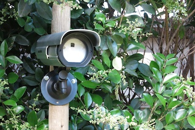
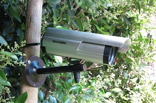

Picammory
=========

The Garden's Camera based on Raspberry Pi (with motion detection)

## Introduction

This project build a high definition camera from a dummy outdoor camera.  
The camera objective are to:

1. Take hourly full definition picture of the garden
2. Detect garden's intrusion from a noisy environment (tree, leaf, wind, sun, ...)
3. Record garden local temperature and humidity to feed the sprinkler controller (TBD)

Picammera includes the following item:

* Capture of one full size image every hour
* Python3 with C functions for fast image processing
	* Image capture: 100ms
	* Image processing: 26ms
* Advanced motion detection algorithms from 5 stages:
	1. Moving Average of previous image (with low memory usage)
	2. Difference between moving average and current image
	3. Moving Average Mask to automatically remove noisy pixel
	4. Surface detection to convert adjacent pixels to surface (with very efficiant algorithm)
	5. Surface processing to detect motion
* Continus HD video recording in memory
* Save about 10s of video before the trigger event
* send mail upon motion detection
* upload movies on a FTP server
* automatically convert h264 movies to mp4
* Bonjour to advertise services
* ASP for easy file sharing with Mac
* WiringPi for GPIO access without root privilege
* Automatic start at boot, and restart after a crash (restartd)

## Hardware Build

An overview of the hardware, and electronic schematic, used to build the camera:

[Hardware](HARDWARE.md)

## Software Installation and Setup

A complete step by step installation:

[Software](SOFTWARE.md)
  
## Motion detection Algorithm

TBD
