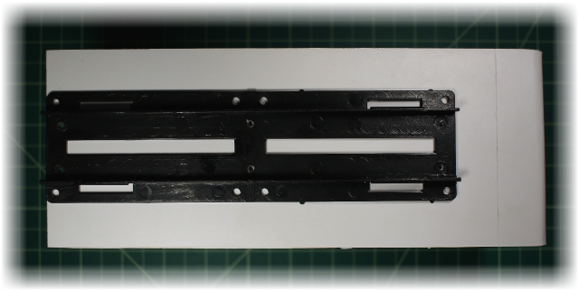
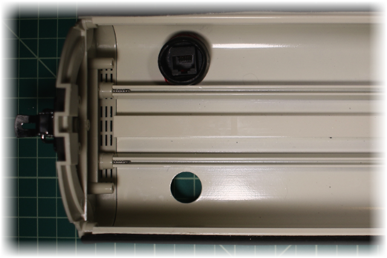
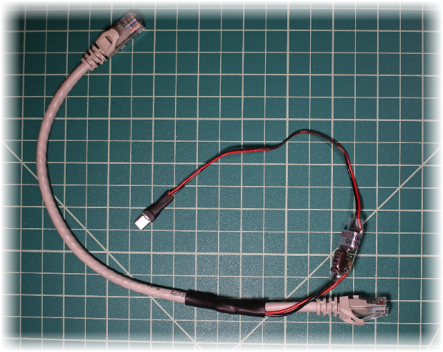

Picammory Mark II
=========

The Garden's Camera based on Raspberry Pi (with motion detection)

The Mark II includes a roomy waterproof casing and a more cleaner assembly.

 

[TOC]

# Introduction


This project build a waterproof high definition camera.

The camera objective are to:

1. Take hourly full definition picture of the garden
	* In the future a hight speed movies of the garden evolution over a year can be created.
	* See change in garden following watering setting changes.
2. Detect and record garden's intrusion within a noisy environment (tree, leaf, wind, sun, ...)
	* Security
	* Squirrel observation


Picammera includes the following item:

* Capture of one full size image every hour
* Mix of Python3 and C code for fast image processing
	* Image capture: 100ms
	* Image processing: 26ms
* Advanced motion detection algorithms from 5 stages:
	1. Moving Average of previous image (with low memory usage)
	2. Difference between moving average and current image
	3. Moving Average Mask to automatically remove noisy pixel
	4. Surface detection to convert adjacent pixels to surface (with very efficient algorithm)
	5. Surface processing to detect motion
* Continus HD video recording in memory
	* Save about 10s of video before the trigger event
* Upload movies on a FTP server
* Automatic start at boot, and restart after a crash (restartd)
* Automatically convert h264 movies to mp4 for easy viewing on Mac/PC
* Bonjour to advertise services
* ASP for easy file sharing with Mac

# Hardware Build


An overview of the process used to build the camera

## Camera Body


The camera body is composed of aluminum body, with good waterproofing, and an excellent 2 axes orientation system.


The inside is very roomy. A platform on rail can be used to secure the circuit board.  

## Components platform

The Raspberry Pi, and all future components, are placed on a platform (Styrene Sheets 0.080" tick), this way it is easy to insert and remove the Pi from 

From a 12"x12" styrene sheet, we cut a band of 3.5" (90mm) large.


We them bend the extremity of the sheet to a 90º angles. This will constitute the front covering the camera body window.
The bending is easy done by warming the styrene with a heat tool (like the [Portasol 75-Watt Heat Tool](http://www.amazon.com/dp/B003HHK7KG))


### Camera mount


A square hole is drill in the middle of the component platform to handle the camera.
We used a Dremel rotary tool with a [194 high Speed Cutter](http://www.dremel.com/en-us/Accessories/Pages/ProductDetail.aspx?pid=194) to create  the preliminary square shaped hole.
The square is them adjusted with a precision blade (like the [X-ACTO Blade](http://www.amazon.com/dp/B00JWFIKOC)).

### Raspeberry attach


The Raspeberry is centered on the platform, with a distance "comfortable" for the camera cable.
We drill 4 holes with a No 43 drill, and create a female screw thread with a tap 4-40 NC.

Note: To avoid misplaced hole, we check after each drilling if all fit well by trying the Raspberry.

We help 


Screw the 4 Hex Standoff (Nylon, #4-40, 1/4" lenght).


Put the Raspberry on the standoff, and secure with 4 screw.
Check if everything fit.


We need cut the small part of the standoff screw that get out of the styrene sheet, or they will prevent later on the styrene sheet to touch the camera platform).
Note: Another possibility to avoid cutting the standoff is to invert the order of creating the Raspberry attach with the camera platform and drill the hole for the standoff through both platform.

The Raspberry is set.
We can now remove it and put it in a safe place until the final integration.

### Camera platform on rail


The component platform is fixed on the top of the camera platform.
The existing 8 holes cannot easily be used, they are in direct contact with the camera rail, no space for nut or screw head. It is probably possible the create a female screw thread in the existing platform hole, but because a "lot" of forces is needed to unclips the camera platform from the rail, we prefers to add some nuts here.



The camera platform is placed under the component platform, centred in larger, but align to the extremity of the platform to limit traction on the component platform when unclipped from the camera.

The idea is to drill 6 holes. create a female thread plus 4 nuts at the extremity.

Usually it is not a good idea to assemble multiple piece with female screw thread, difficult to make it right and tight all layer together. Both platform should have hole without thread and nut at the end to tight everything. But here plastic are malleable, and we expect to tap all the piece at the same time, should be fine, and we get a better coupling by having more thread.

We using a drill No 43 and tap 4-40NC.

First one hole on the left side (border) is drill, tap, and them put bold and screw to maintain in position.
Same for the opposite side in diagonal hole.
Now we have all pieces thigh together, we can safly drill the 4 others hole.


The 6 screw in place on the component side.

Note: the head of screw are way lower than the Raspberry Pi on standoff.


The 6 screw with the 4 nuts on the rail side.

## Waterproof Ethernet connector

The first version of the camera was weak on waterproofing at the external camera network connection.
The second version use a Waterproof RJ45 Coupler


The existing hole in the camera body are 18.9mm and the coupler 25mm. We need a bigger hole.
The camera box is constitute of aluminum 1.2mm. A Dremel rotary tool with a [194 high Speed Cutter](http://www.dremel.com/en-us/Accessories/Pages/ProductDetail.aspx?pid=194) can easily fix that.


The camera rail prevent a symmetrical expansion of the hole, the RJ45 couple will not fit. The hole need to be shifted.

Before to remove some metal, let draw carefully the part to remove. Here in black the part to remove, and red the extreme limit to not pass.


The big hole finished.


The RJ45 coupler is designed to joint 2 ethernet cable, and assure the waterproofing on both side. Because one side will be inside the already waterproof camera box, we can safly remove one side waterproofing.



We get an external camera network connector through a nice female to female RJ45 coupler, with the external side waterproof, and a low profile inside side.

## Power Over Ethernet (POE)

### Power Over Ethernet (POE) and Passive POE

The standard implementation [Power over Ethernet](http://en.wikipedia.org/wiki/Power_over_Ethernet) is complex and expensive.
A non-standard implementations named "[passive](http://en.wikipedia.org/wiki/Power_over_Ethernet#Passive)", is more friendly.

The passive PoE use the fact when an ethernet cable is used for 10 and 100Mb only 4 wire over the 8 available are used for data, and 4 are unused.

RJ45 Pin| Wire Color 		| Wire Diagram											| 100Base-T  	| 1000Base-T
-------:|-------------------|:-----------------------------------------------------:|---------------|------------
1		|	White/Green		| 	|	Transmit+	|	BI_DA+
2		|	Green			| 				|	Transmit-	|	BI_DA-
3		|	White/Orange	| 	|	Receive+	|	BI_DB+
4		|	Blue			| 				|	Unused		|	BI_DC+
5		|	White/Blue		| 		|	Unused		|	BI_DC-
6		|	Orange			| 		|	Receive- 	|	BI_DB-
7		|	White/Brown		| 	|	Unused 		|	BI_DD+
8		|	Brown			| 				|	Unused 		|	BI_DD-

The passive PoE Injector used the 4 remaining wire to provide power, grouping them by 2:

|||Connected to|
-:|-|-:|-:
	4 (Blue)  | + | 5 (White/Blue)  | DC+
    8 (Brown)  | + | 7 (White/Brown)  | 0V

The Raspberry Pi needs 5V, but 5V cannot be transported over a long distance (voltage drop). Usually 24V or 48V is used.

Since the camera is not very far and we have CAT6 with 23 AWG wire, we opt for 12V DC.
The DC/DC converter in the camera take between 5 to 23v input to output 5V.


### Passive PoE Injector


On the router side, we connect the “Passive PoE Injector/Splitter DC Connector” between the router and the network cable going to the camera. Connect a 12V DC power supply to the DC connector.

### Passive PoE Splitter

The same cable can be used to extract the power, but the splitter is bulky, does not provide the micro USB connector the Raspberry Pi needs. This solution is too complex and bulky for the camera side.

Instead we can create a compact custom splitter.


We start with a 1 foot ethernet cable, we remove a band of the external sheath near one extremity.


Cut the Blue  and White/Blue , and solder them togethers.
Cut the Brown  and White/Brown , and solder them togethers.


Take the DC/DC Converter, Put a small Heat Shrink tubing on each power cable, and a bigger one on both.
Solder the Blue  with the DC/DC Converter Red .
Solder the Brown  with the DC/DC Converter Black .


Cover both power wire with the tubing and shrink them.
Them same for the bigger tubing over the two power wires.
Small tubing are also put on the 4 remaining cut wire.


Finally, put a big tubing to cover all exposed wire.


On the other side of the DC/DC Converter, cut the provided connector, to replace it with a micro USB connector.


Solder the red and black wire on the pin 1 and 5.

Note: the pin 1, 3, and 5 are really near of each other, to avoid soldering the pin3, it can just be cut from the micro USB connector.


Add some glue (from a glue gun) on the micro USB pin and put on top a Heat Shrink tubing.



The final cable, compact and simple.


The ethernet cable in place.

Note: We initially just put the DC/DC converter under the component platform, later on, we use a cable tie to attach the converter to the ethernet cable.


## Camera Sensor


We finally use our little square hole to insert the camera

Note: Compare to the first version, the space between the sensor and raspberry pi permit to the camera the standard orientation.

## Final results


Very simple and clean implementation, with a lo of space for future expansion.

Note: we removed the RGB LED and temperature sensor from the first version, they was not very useful.


## Parts and Cost

Type | Reference | Pack | Qty | Price | Store
------------|-----------|------|----:|------:|:-----:
CPU | Raspberry Pi Model B+ | | 1 | $28.48 | [Amazon](http://www.amazon.com/gp/product/B00LPESRUK)
Sensor | Raspberry PI 5MP Camera Board Module ||1| $25.00 | [Newark](http://www.newark.com/raspberry-pi/rpi-camera-board/unknown/dp/69W0689)
Camera Body | Outdoor Weatherproof Heavy Duty Aluminum CCTV Security Surveillance Camera Housing Mount Enclosure M57 ||1| $24.99 | [Amazon](http://www.amazon.com/gp/product/B004CBGFOS)
Ethernet | AEAC Waterproof RJ45 Coupler, Female to Female Interface diameter 25mm ||1| $14.99 | [Amazon](http://www.amazon.com/gp/product/B00FUVKZRM)
Power Supply | DC 12V 2A ||1| $13.00 |
SD Card | Transcend 16 GB ||1| $7.85 | [Amazon](http://www.amazon.com/gp/product/B00FB463E2)
DC/DC Converter | UBEC Input: 5-23v Output:5V 3a | | 1 | $4.76 | [Amazon](http://www.amazon.com/gp/product/B00DSKJGIQ)
Power part | Huacam HCP05 Passive PoE Injector/Splitter DC Connector |2 for $6.89|1| $3.45 | [Amazon](http://www.amazon.com/gp/product/B00DZLSRJC)
Board | Styrene Sheets - White - 12x12 0.08 Thick|4 for $10.99|1| $2.75  | [Amazon](http://www.amazon.com/gp/product/B00ICMZ62A)
Ethernet | Cat6 Ethernet Patch Cable 1 Foot | 5 for $9.99 | 1 | $2.00 | [Amazon](http://www.amazon.com/gp/product/B00C2DZ7Z6)
Screw | Nylon 6/6 Machine Screw, Plain Finish, Off-White, Pan Head, Slotted Drive, 1/4" Length, Fully Threaded, #4-40 Threads | 100 for $5.13 | 10 | $0.51 | [Amazon](http://www.amazon.com/gp/product/B00137GQUW)
Screw | Hex Standoff, Nylon, Male-Female, UNC Threads, Right Handed, Off-White, #4-40 Screw Size, 1/4" Length| 100 for $10.98 | 4 | $0.44 | [Amazon](http://www.amazon.com/gp/product/B00137P8JW)
USB connector | Micro USB Type A Male 5 Pin Connectors Jack|10 for $3.90|1| $0.39 | [Amazon](http://www.amazon.com/gp/product/B00AQWUCAA)
Screw | Nylon 6/6 Small Pattern Machine Screw Hex Nut, Off-White, #4-40 Thread Size, 1/4" Width Across Flats, 7/64" Thick | 100 for $5.63 | 4 | $0.23 | [Amazon](http://www.amazon.com/gp/product/B000FN0C4Q)
| Heat Shrink tubing | | 1 | $0.10 |
***Total*** | | | | ***$128.94*** |

# Software Installation and Setup

A step by step installation


## Setting Up the Raspberry Pi

To download and install Raspbian, follow the procedure from http://www.raspberrypi.org/downloads.

Note: at the writing, we used the Raw Images Raspbian, Release Date	2015-02-16

After putting the micro SD card in a USB reader, we run from the terminal something like:
``` bash
diskutil list
diskutil unmountDisk /dev/<disk# from diskutil>
sudo dd if=path_of_your_image.img of=/dev/<disk# from diskutil> bs=1m
```

	<!> Warning: giving a wrong device for '/dev/<disk# from diskutil>' can damage your computer,
		be extremely careful with 'dd' command.

Wait a LONG time!

Insert now the micro SD card in the Raspberry Pi.

## Raspbian Initial Settings

Connect to the new Raspberry Pi computer, and start the initial configuration:

``` bash
$ ssh pi@<ip address>
  password: raspberry
$ sudo raspi-config
```
Modify the following item:

* 1 ***Expand Filesystem***

* 2 ***Change User Password***

* 4 Internationalisation Options

	* I1 Change Locale (to adapt to your own locale)
	    * Remove en_GB.UTF-8 UTF-8
	    * Add en_US.UTF-8 UTF-8
	    * select ok
	    * Set default to "en_US.UTF-8"
    * I2 Change Timezone (to adapt to your own timezone)
	    * US
	    * Pacific Ocean


* ***5 Enable Camera***

* Advanced Options

	* A2 Hostname

		* PiCammoryGarden

* <Finish>

* Reboot now
	* Yes

Notes:
* only step 5 is required. 1 and 2 are strongly suggested.
* If raspi-config does not offert you to reboot, them manually reboot with:
        
	``` bash
	$ sudo shutdown -r now
	```

After rebooting, check if time and timezone are correct:

``` bash
$ date
```
        
## Update Raspbian

``` bash
$ sudo apt-get update
$ sudo apt-get upgrade
$ sudo rpi-update
```

A reboot is needed to activate the new firmware

## Install Netatalk & Bonjour
Netatalk is a freely-available Open Source AFP fileserver.
With Netatalk, PiCammory is visible in MAC OS X Finder (thanks to Bonjour), you can copy file with Finder (AFP). Publish the existence of SSH is  just to looks nice.

``` bash
$ sudo apt-get install netatalk
```
Register ASP (File sharing with Mac)
``` bash
$ sudo nano /etc/avahi/services/afpd.service

<?xml version="1.0" standalone='no'?>
<!DOCTYPE service-group SYSTEM "avahi-service.dtd">
<service-group>
    <name replace-wildcards="yes">%h</name>
    <service>
        <type>_afpovertcp._tcp</type>
        <port>548</port>
    </service>
</service-group>
```
Register SSH (Remote Shell)
``` bash
$ sudo nano /etc/avahi/services/ssh.service

<?xml version="1.0" standalone='no'?>
<!DOCTYPE service-group SYSTEM "avahi-service.dtd">
<service-group>
    <name replace-wildcards="yes">%h</name>
    <service>
        <type>_ssh._tcp</type>
        <port>22</port>
    </service>
</service-group>
```

Restart the Avahi mDNS daemon:

``` bash
$ sudo /etc/init.d/avahi-daemon restart
```

Now the Raspberry should be visible in the Finder (computer PiCammoryGarden), use your 'pi' account to connect.

Optionally you can install some tools to test Bonjour.

Browse for mDNS/DNS-SD services using the Avahi daemon
``` bash
$ sudo apt-get install avahi-utils

$ avahi-browse -a | grep PiCammoryGarden
+   eth0 IPv4 PiCammoryGarden                               Remote Disk Management local
+   eth0 IPv4 PiCammoryGarden                               SSH Remote Terminal  local
+   eth0 IPv4 PiCammoryGarden                               Apple File Sharing   local
+   eth0 IPv4 PiCammoryGarden [xx:xx:xx:xx:xx:xx]           Workstation          local
```

## Install PiCamera

This package provides a pure Python interface to the Raspberry Pi camera module for Python 3.2 (or above).

[http://picamera.readthedocs.org](http://picamera.readthedocs.org)

``` bash
$ sudo apt-get install python3-picamera
```

## Install Python3 PIL
Python Imaging Library

``` bash
$ sudo apt-get install python3-pip
```

``` bash
$ sudo pip-3.2 install Pillow
```

## Install GPAC
Multimedia Framework for MPEG-4, VRML, X3D, SVG, LASeR ...
http://gpac.wp.mines-telecom.fr

``` bash
$ sudo apt-get install gpac
```

## Install Picammory


### Download Picammory sources

for the last released version:
``` bash
$ git clone https://github.com/pmermoz/picammory.git ~/picammory
```

or, for the current development version:
``` bash
$ git clone https://github.com/pmermoz/picammory.git -b develop ~/picammory
```

### Build the C source code
Note: This step is optional, Picammory will rebuild the C code at startup.
``` bash
$ cd ~/picammory; python3 setup.py build_ext --inplace; cd ..
```

### Create the log files folder

``` bash
$ sudo mkdir /var/log/picammory
$ sudo chown pi /var/log/picammory
```

### Edit the configuration file
``` bash
$ cp ~/picammory/picammory.ini_template ~/picammory/picammory.ini
$ nano ~/picammory/picammory.ini
```
Modify the following entries:

Section | Name | Description
--------|------|-------------
[camera]| |
		| name | Name for your camera, this name is used to prefix filenames generated by the camera.
[smtp]  |      | 	Picammory send mail to inform of system status and detection events.
 		|username|User name for your email account
		|password|Password for your email account
		|usetls|YES to use encrypted communication with the email server
		|server|Mail server Address and port (like 'smtp.mailserver.com:587')
[email]	||
		|recipient|Email address (or list of) for the recipient of alert
		|sender|Email address to identify this program (like 'GardenCam <<mycamera@mydomain.com>>')
[ftp]	|| Picammory upload videos and pictures to an FTP server
		|username|FTP user name
		|password|FTP password
		|server|FTP server Address

## Install the Automatic start at boot

Copy the boot script for automatic start at boot time:

``` bash
$ sudo cp ~/picammory/etc/init.d/picammory /etc/init.d/
```

Make The Startup Script Executable

``` bash
$ sudo chmod 755 /etc/init.d/picammory
```

Make The Script Run at Startup

``` bash
$ sudo update-rc.d picammory defaults
```

## Install the Automatic restart
Restartd is a daemon for checking running processes. It execute a script or a program if the process is not running anymore.

Note: Restartd can take up to 20s to restart a dead process.


```bash
$ sudo apt-get install restartd
$ sudo nano /etc/restartd.conf

picammory ".*picammorydaemon.py*" "service picammory restart"
```

## Finally, Reboot

Reboot the system
``` bash
$ sudo shutdown -r now
```

  
# Motion detection Algorithm

TBD
